# Burger Queen (API Client)

## Index

* [1. Introduction](#1-introduction) 
* [2. User Stories In Interface](#2-user-stories-in-interface) 
* [3. Low Fidelity Prototypes](#3-low-fidelity-prototypes) 
* [4. High Fidelity Prototypes](#4-high-fidelity-prototypes) 
* [5. Usability Tests](#5-usability-tests)
* [6. Diagram](#6-diagram)

***
## 1. Introduction

Burger Queen (API Client) is an application designed for a small burger restaurant that has been expanding so you need an automated system,  creating in the first instance an interface where the server can take orders and send them to the kitchen in an orderly manner, where later the cook is marking orders that are ready and so the server can deliver them, in addition, the manager of the restaurant can add, delete, and edit products and users or employees, in order to control the roles of workers and the business.
You can try the Burger Queen [website](https://burgerqueenrestfam.vercel.app/login) with this credential:

Email:  grace.hopper@systers.xyz
Password:  123456

## 2. User Stories In Interface

User story # 1

The waiter/Waitress must be able to enter the system if the admin has already assigned credentials
As a waiter/waitress, I want to be able to enter the ordering system.

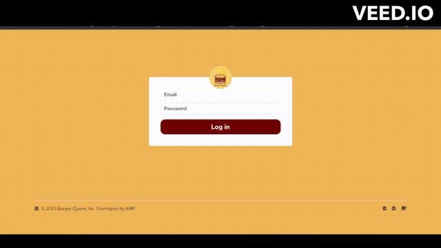

User story #2
The waitress/Waiter must be able to take customer orders.
As a waiter/waitress, I want to take the order from a client so as not to depend on my bad memory, to know how much to charge, and send it to the kitchen to avoid mistakes and so that it can be prepared in order.

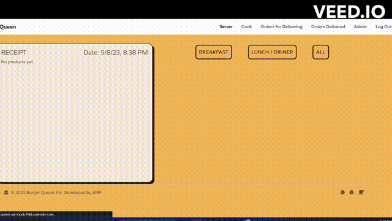

User story #3 

The chef should be able to see the orders.
As a chef, I want to see the clients' orders in order and mark which ones are ready to know what needs to be cooked and notify the waiters that an order is ready to be served to a client.

User story #4
The waitress/waiter should see orders ready to serve
As a waiter/waitress, I want to see the orders that are ready to be delivered quickly to the customers who made them.

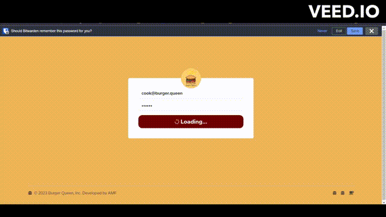

User story #5
The restaurant manager must manage the workers.
As a restaurant administrator, I want to manage the users of the platform to keep the information of my workers updated.

User story #6
A restaurant manager should manage the products
As a restaurant administrator, I want to manage the products to keep the menu updated.

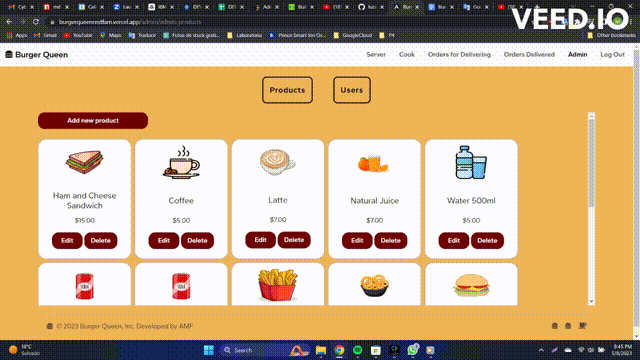

## 3. Low Fidelity Prototypes

We created low-fidelity prototypes by making several drawings on paper so we could discuss our ideas and choose the best one for this project and each user and view. Our prototypes were designed for iPad and computers since our users will not use the application on mobile devices. 

## 4. High Fidelity Prototypes

We designed high-fidelity prototypes on Figma and they were really helpful because we could see some flaws in our design and then we improved them. The high-fidelity prototypes were created specifically for each user, for instance, the server, the cook, and the administrator, we also used a color palette to give it uniformity and we also tested the contrast with the letters to reach our goal. In this project, it is important to mention that we use Bootstrap for our interface in conjunction with CSS. For example, we use it to create the nav, modals, tables, cards, buttons, etc. Additionally, we created a logo for the Burger Queen Restaurant. 

Logo:

Color Palette:
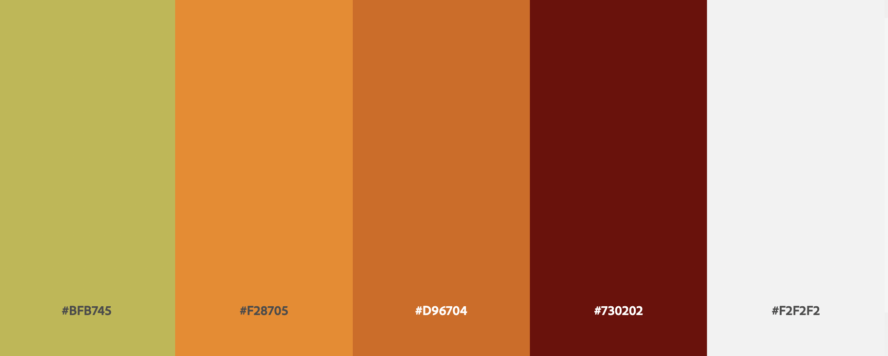

High-Fidelity Prototypes:

## 5. Usability Tests
To define how good is the user experience in general terms, we created a [survey](https://forms.gle/Zx5xVSLCsb6WqFf69) about our application with five questions to find out if the website is accessible and easy to use for a server, a cook or an administrator working in a restaurant. Also, to know what we can improve or if they found any type of error. 

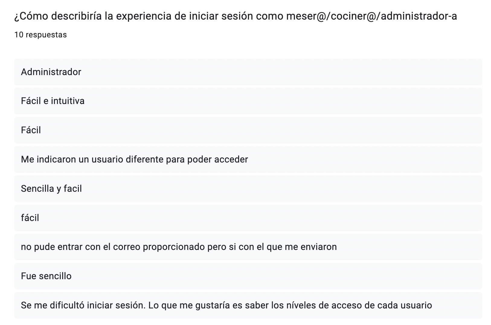
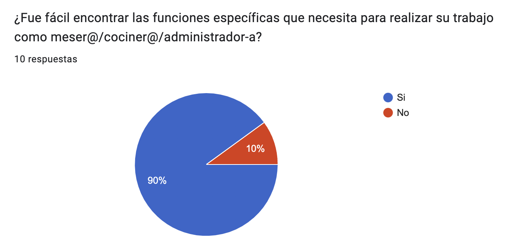
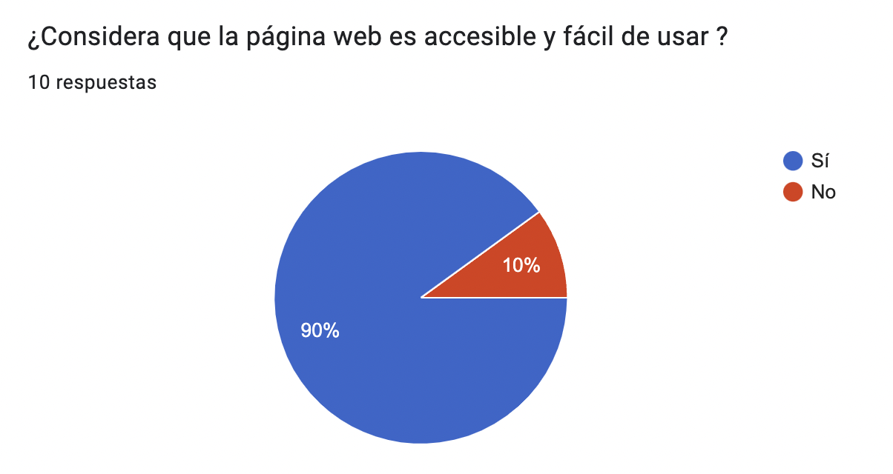
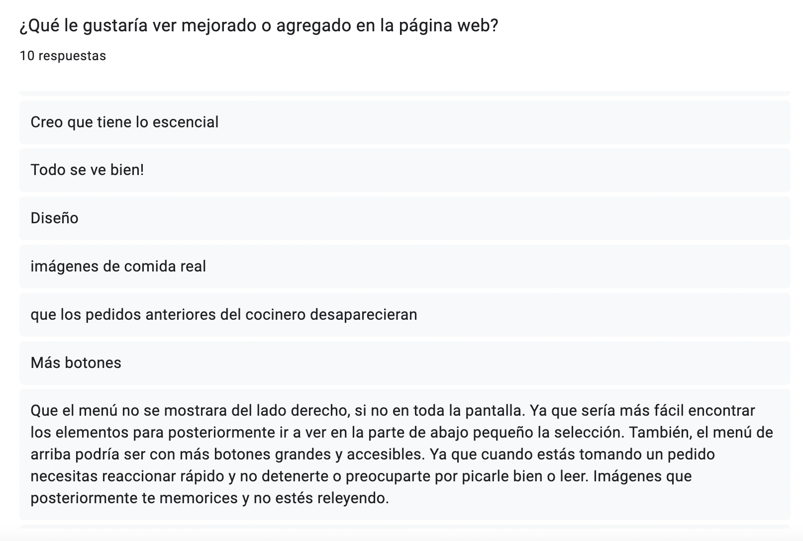
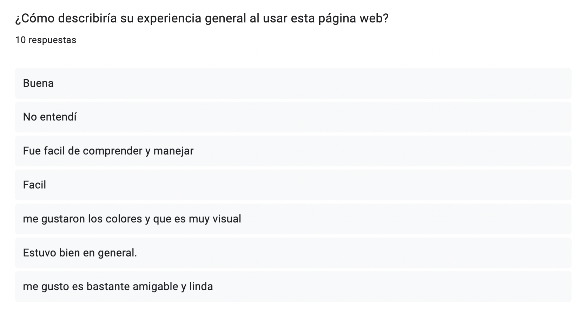

## 6. Diagram

For a better understanding of the HTTP request-response flow from our angular application to our API mock, we decided to make a flowchart:
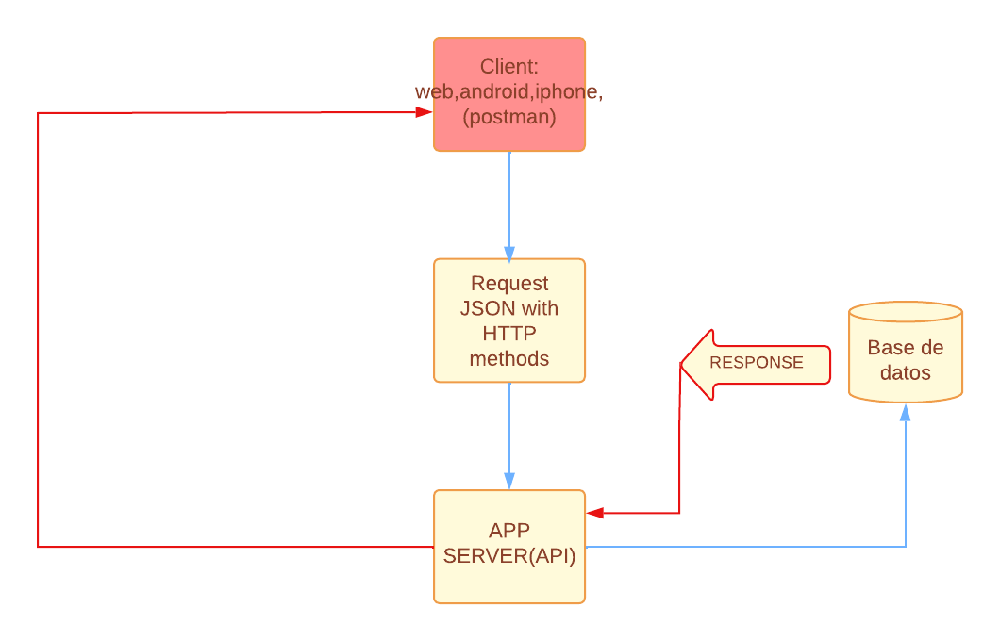

